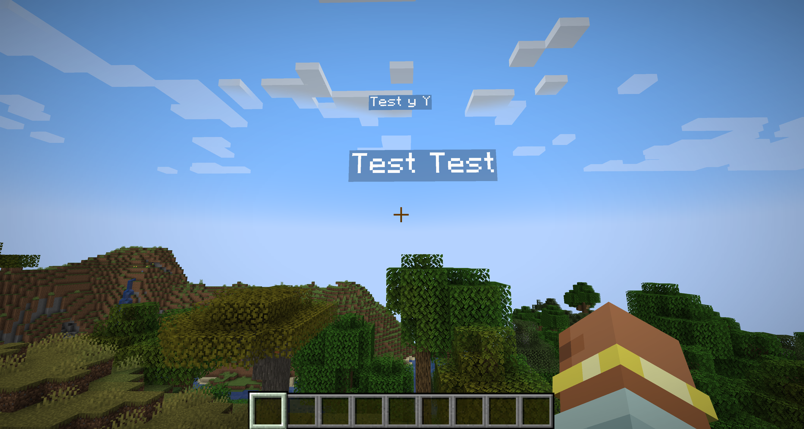
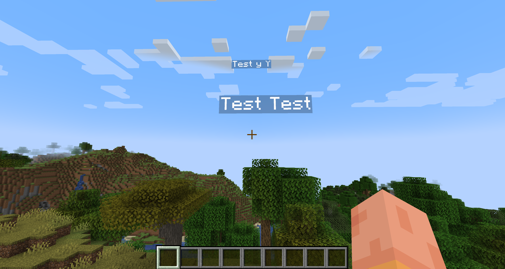

# EnZasRenderGlitchPatchModForMinecraft

This mod fixes the height of text display entities being 1 pixel too high then it should be.

Before:

After:

## Contact
If you encounter any issues, please report them on the [issue tracker](https://github.com/FlorianMichael/EnZasRenderGlitchPatchModForMinecraft/issues). If you just want to talk or need help with BaseProject feel free to join my [Discord](https://discord.gg/BwWhCHUKDf).
